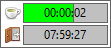
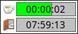

# another-day
[](https://github.com/KyrietS/another-day/actions/workflows/build.yml)
[](https://github.com/KyrietS/another-day/actions/workflows/formatting.yml)
[](LICENSE)

another-day is your personal working time guardian. It is an easy to use desktop application that alerts you when it's time to take a break or stop working.

|Windows|Linux (KDE)|
|---|---|
|||

## Features

- ✅ *Take a break* reminder
- ✅ *End of working hours* alert
- ✅ Sound notification
- ✅ Neat and clean GUI
- ✅ Supports Windows and Linux
- ✅ Tray support
- ✅ Customizable settings

## Building
```
git clone git@github.com:KyrietS/another-day.git
cd another-day
cmake -S . -B build
cmake --build build --target another-day
```

## License

Copyright © 2025 Sebastian Fojcik \
Use of this software is granted under the terms of the MIT License.

See the [LICENCE](LICENSE) for the full license text.
